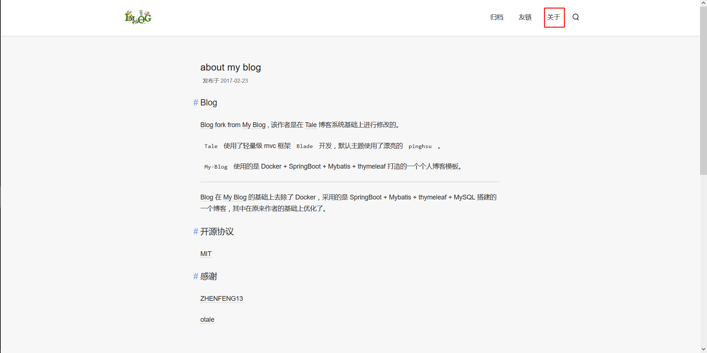
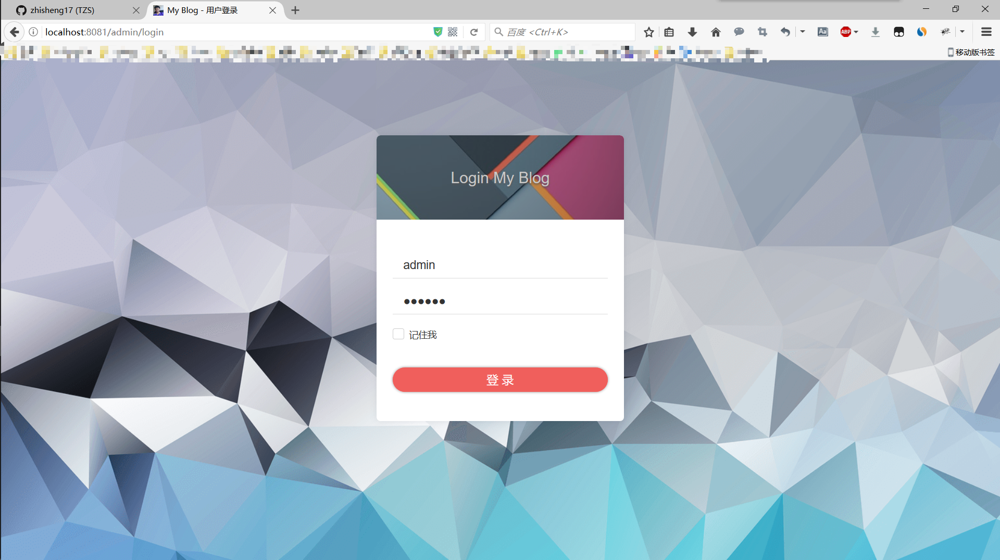
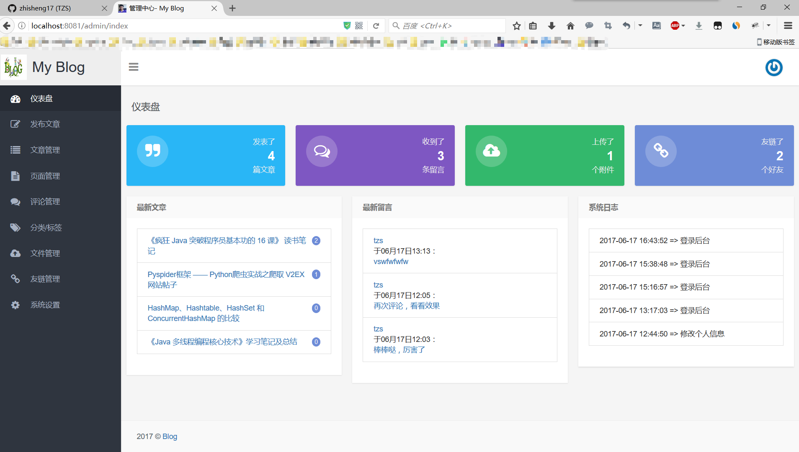
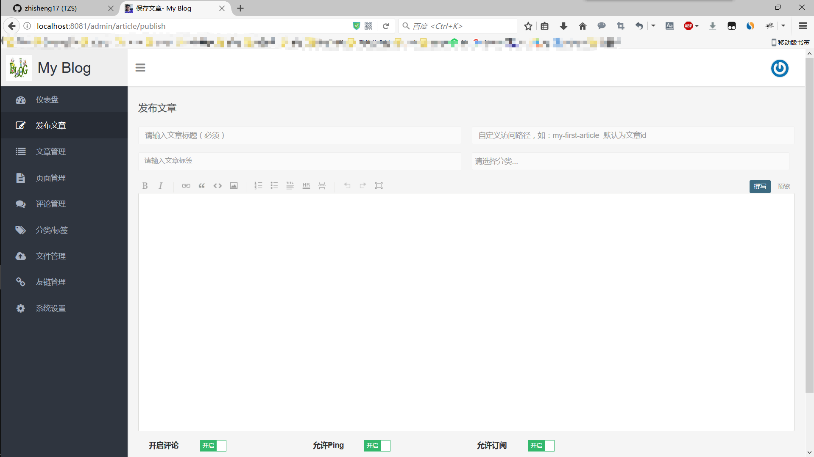
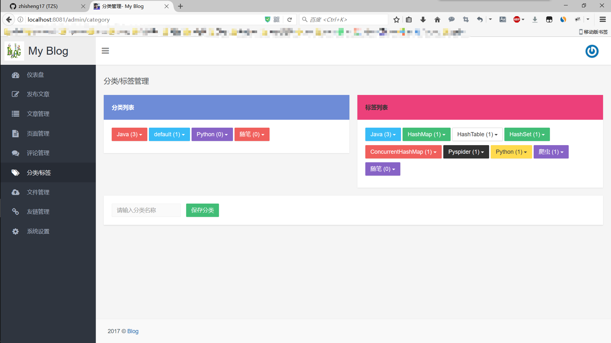
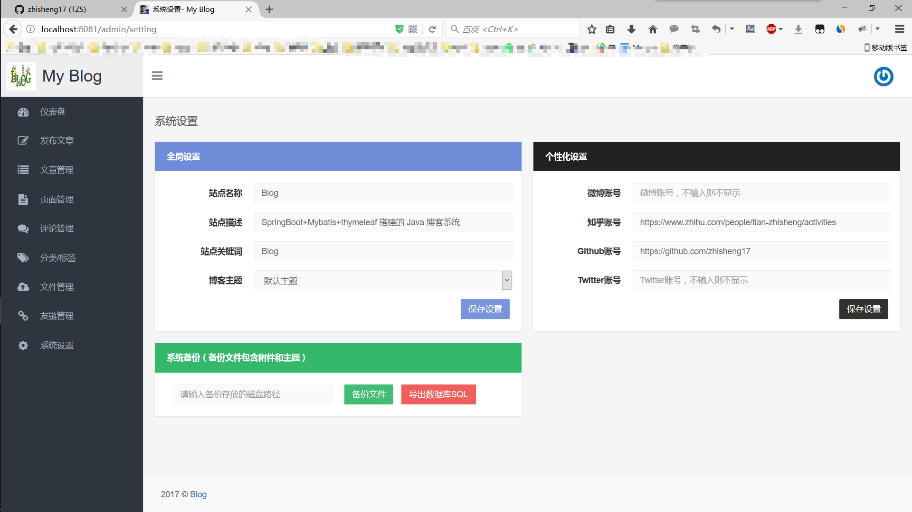

## MyBlog

fork from [My Blog](https://github.com/ZHENFENG13/My-Blog) , 该作者是在 [Tale](https://github.com/otale/tale) 博客系统基础上进行修改的。

`Tale` 使用了轻量级 mvc 框架 `Blade` 开发，默认主题使用了漂亮的 `pinghsu` 。

`MyBlog` 使用的是 SpringBoot + thymeleaf + JPA 打造的一个个人博客模板。

### 我在原作者的基础上改进了markdown和文章目录的显示，增加了latex 数学公式的支持，添加了文章归档

### 注意：各位同学使用我的博客的时候记得把logo改掉。。。还有记得把lovestory页面删掉。。。。。（狗粮

在线效果：[我的博客](http://hslovelal.top/)

##计划

 1. 添加置顶博客选项

喜欢该项目的话，可以给项目点个 star，如果你想在这基础上修改，那么建议你 fork 该项目，然后再修改哦。
## 新增功能如下：

 侧边栏目录：
 

 分类：
 

 latex数学公式：
 
 

## 原博客功能如下：

 博客首页：
 

 归档：
 

 友链：
 
 
 关于：
 
 
 搜索：
 
 
 **后台管理**
 
 管理登录：
 
 
 管理首页：
 
 
 发布文章：
 
 
 文章管理：
 
 
 页面管理：
 
 
 分类标签：
 
 
 文件管理：
 
  
 友链管理：
 
   
 系统设置：
 
 
## 开源协议

[MIT](./LICENSE)

## 感谢

[ZHENFENG13](https://github.com/ZHENFENG13)
[otale](https://github.com/otale)
